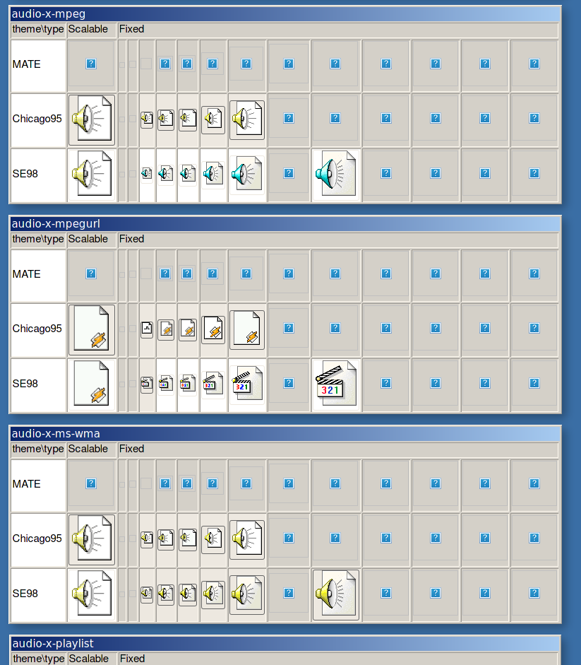
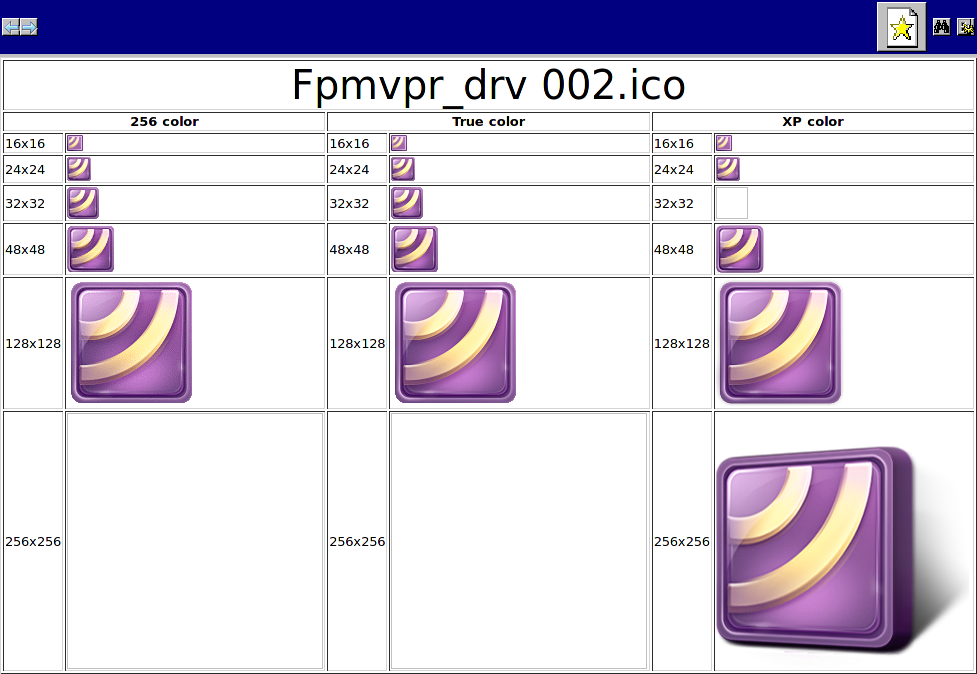
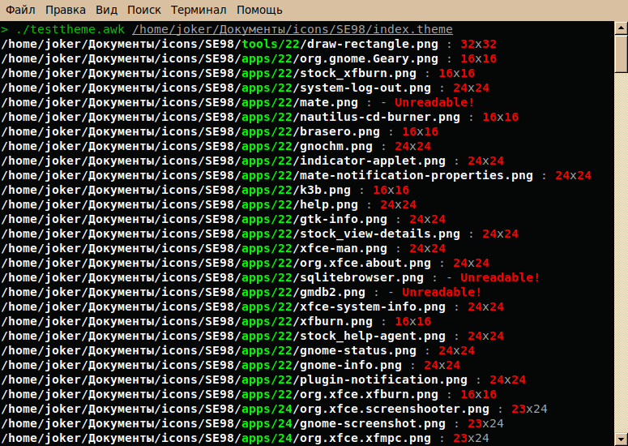
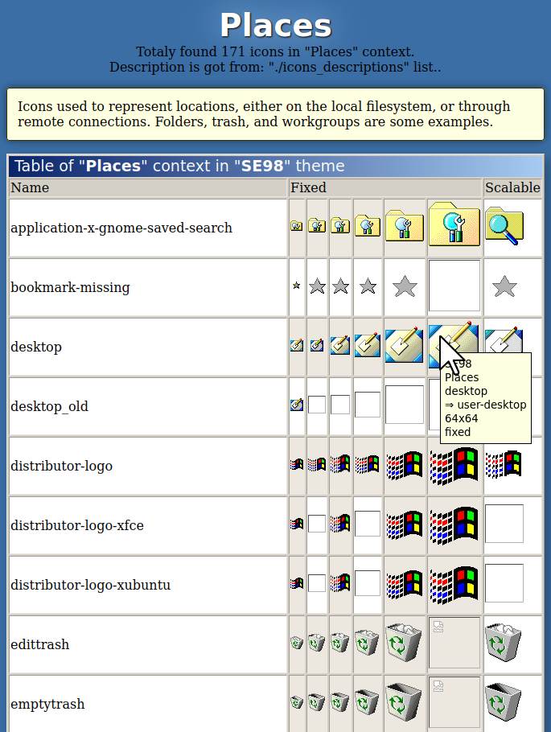

# Scripts for icon themers

## [Compair icon themes](compair-icon-themes.awk)
**[ru] Новый скрипт для сравнения тем значков в виде HTML**<br>
A new script for comparing/rendering icon themes as html-webpages, fully rewrited from zero (not completed yet), but it's about 10x faster then previous because of using gawk C-libraries instead of find/ls/bash commands.<br>
Syntax:<br>
```
compair-icon-themes.awk /path/to/icontheme1/index.html /path/to/icontheme2/index.html > output.html
```
For now you need to edit manually an array of contexts in the script.<br>
*Screenshot:*<br>
<br>
 

## [Icon Table](icontable.awk)
**[ru] Таблица форматов значка виндоус.**<br>
An AWK script, that opens MS Windows® *.ico* files as HTML-tables.<br>
Needed "icoutils" package as dependency.<br>
*Screenshot*<br>
<br>


## [Test icon theme](test-icon-theme.awk)
**[ru] Все ли значки правильно разложены по своим размерам?**<br>
Test if all the PNG icons of an IconTheme have the same size as it was set in icon.theme file.<br>
*Screenshot:*<br>

Requirements:<br>
[GAWK for GNU/Linux](https://www.gnu.org/software/gawk/)<br>
[Gawk libraries:](https://sourceforge.net/projects/gawkextlib/files/)
* gawkextlib
* gd
* readdir
* filefuncs

Installation of **gawk**:<br>
Arch/Manjaro:
```
pacman -S gawk
```
Debian/Ubuntu/Mint:
```
apt install gawk
```
Installation of **gawk extensions**:<br>
Arch/Manjaro (from AUR):
```
yay -S gawkextlib gawk-so
```
or
```
yaourt -S gawkextlib gawk-so
```
or
```
pacaur -S gawkextlib gawk-so
```

Debian/Ubuntu/Mint:
```
git clone git://git.code.sf.net/p/gawkextlib/code gawkextlib-code
cd gawkextlib-code
./build.sh lib
./build.sh gd
```

Syntax:
```
./test-icon-theme.awk /path/to/theme1/index.theme ../../path/to/theme2/index.theme
```
## [Link concentrator (lincentrator)](lincentrator.sh)
Caja/Nautilus script. if you have many identical files with different names, and even soft links to them in one directory, and you need the original to be one, and the rest to be links to it, then this script is what you need! It finds all dupes (even soft links) in current directory by checksum. Select any **<u>different</u>** files or soft links in one directory, and apply this script.<br>P.S. All messages are currently in Russian.

## [Links in Neighbor Folders](link_in_nb_folders.sh)
Bash script. A tool for icon theme makers. it creates relative symlinks in (neighboring to the current) folders to the same targets. Used for Nautilus, Caja and Thunar actions.

The princip of working:<br>
It creates link targeted to "folder.png" with name "folder-closed.png" in folders (for example): theme/places/16, theme/places/22, theme/places/24, theme/places/32 or/and theme/places/## in one action.

## Icon Themes 2 HTML (currently doesn't work! I wnat to rewrite it from beginning)

**iconthemes2html_locale.awk is now required!**

AWK Script for comparing icon themes. It parses *index.theme* file in icon theme folder, finds all icons in all included folders, and creates html files (separated and named by context of icon group) with comparison between themes.<br>How to use:
```
./iconthemes2html.awk [file]... [option]...
```

Files must be correct index.theme files with path.
<br>**Options are:**<br>
**-c** contexts for parsing. Syntax: `-c=Actions,Places,MimeTypes`<br>
**-s** sizes to parse. Syntax: `-s=16,24,32`<br>
**-d** description file. Syntax: `-d=/path/icons_descripnions`<br>
**-u** user list of contexts, icons, and their descriptions; same as **-d**, but ignores icons, those aren't in list. Syntax: `-u=/path/list`<br>
[Example list](icons_descriptions)<br>
Syntax of list:<br>

```
# any comment
Context1 #one word;first letter is Uppercase
Description of context1 #  must contain spaces
# first word - name of an icon w/o spaces or capitals, after <tab> - the description of icon.
icon1	Description of icon1
icon2	Desc of icon2
icon3	Desc of icon3
Context2
Desc of cont2
icon21	Desc of icon21
icon22	Desc of icon22
```

**-f** folder for saving html files. Syntax: `-f=/path`<br>

Single click on icon copies to clipboard absolute path to current icon file, double click copies absolute path to target (if it's a symlink).
Gray background means that current image recognized as is symlink while directory listing.<br>

*Screenshots:*<br>
<br>
When opening a single theme file it draws one table for all icons in context.<br>
