# 'Compair icon themes' screenshots of converting process:
## Naked CLI
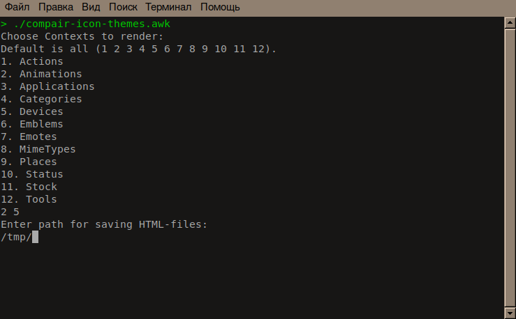
## 'Dialog' CLI windows
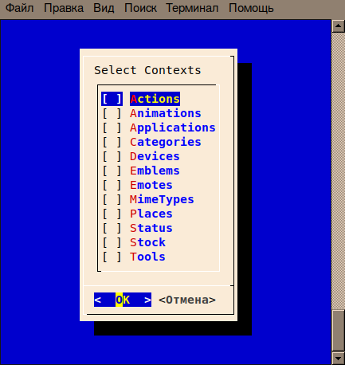
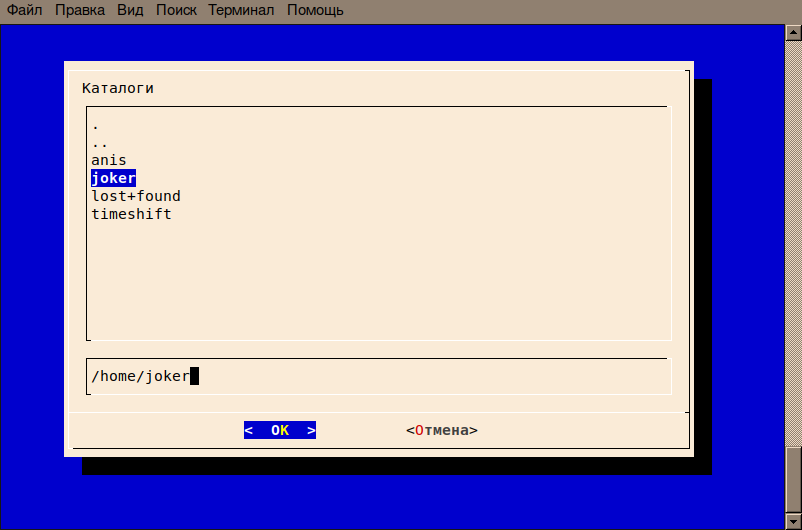
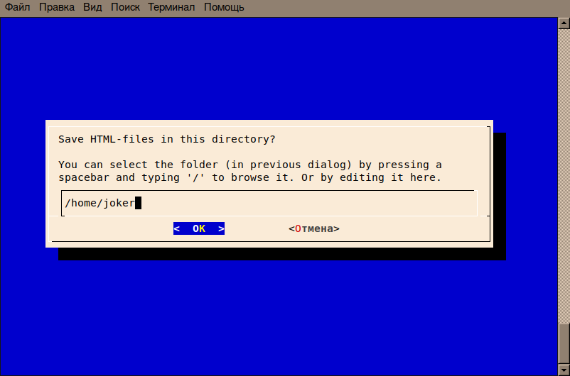
## 'Xdialog' GUI windows
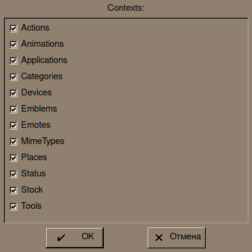
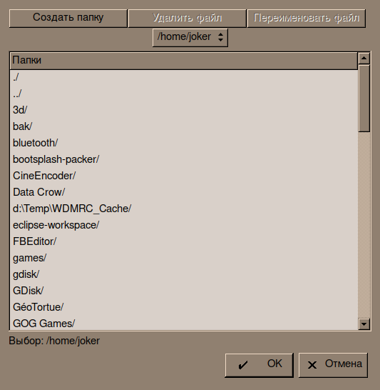
## 'YAD' GUI windows
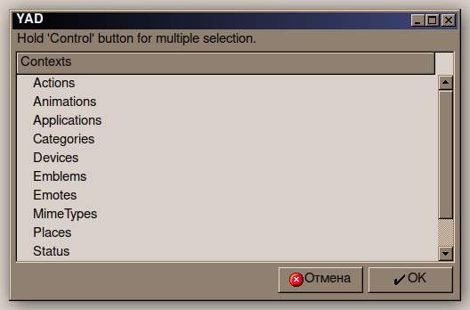
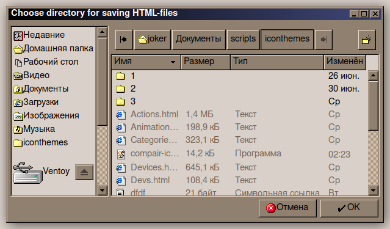
## 'Zenity' GUI windows
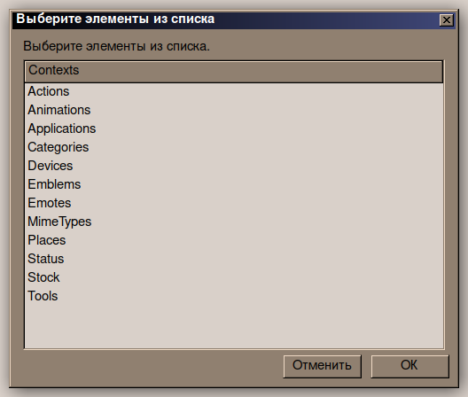
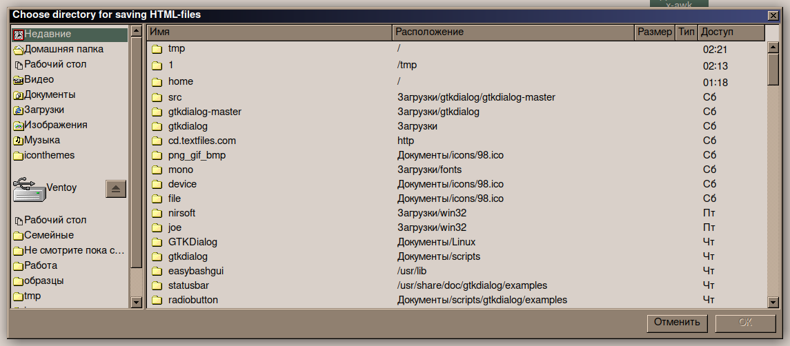
## 'Kdialog' GUI windows
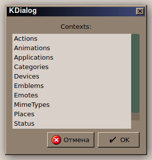
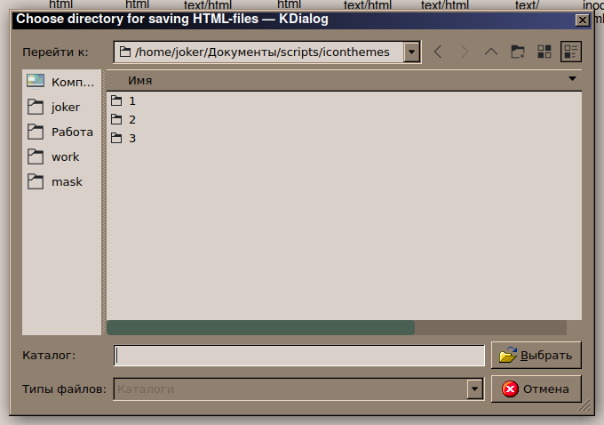
